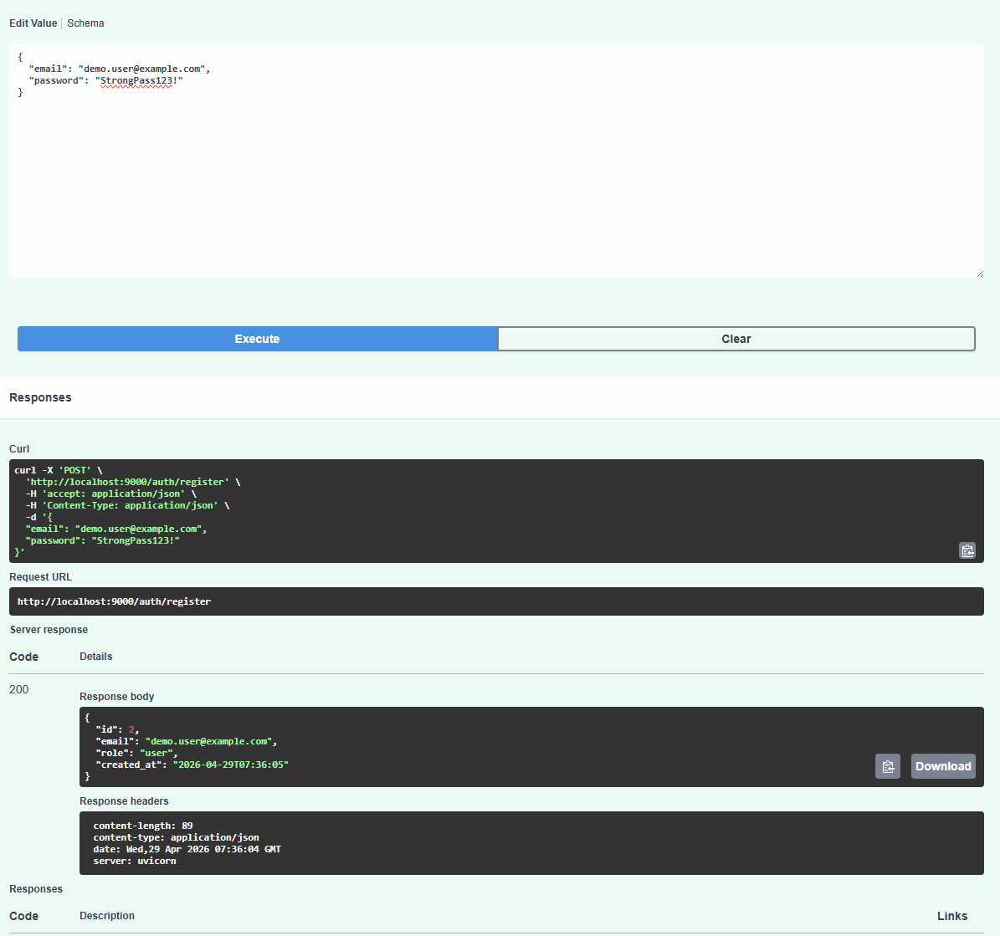
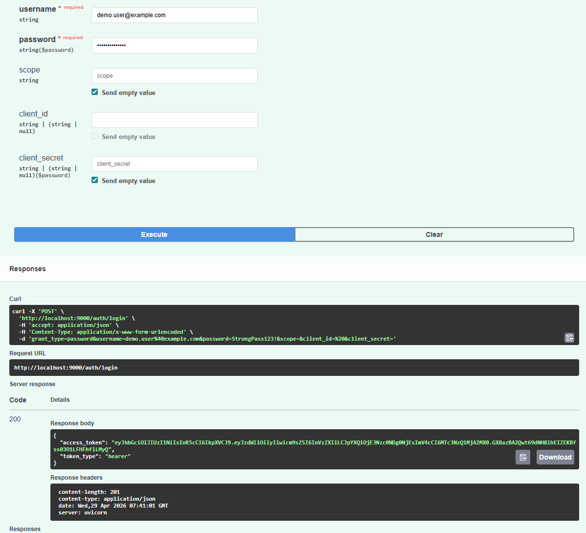
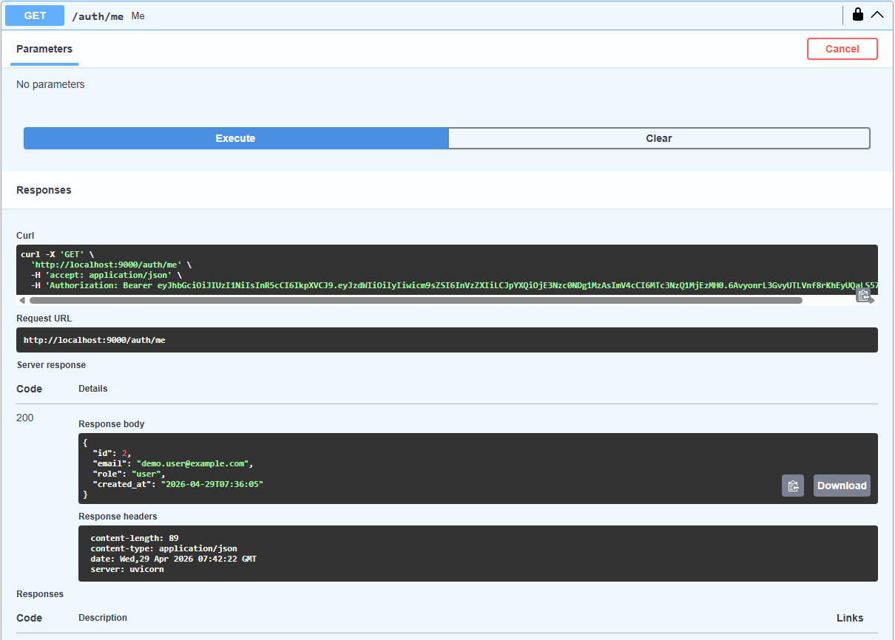

# Final LLM Consult

Двухсервисная система LLM-консультаций с JWT-аутентификацией, Telegram-ботом и асинхронной обработкой через RabbitMQ + Celery.

## Архитектура

Система разделена на два независимых сервиса:

1. `auth_service` (FastAPI)  
   Отвечает только за управление пользователями и выпуск JWT:
   - регистрация пользователя;
   - логин и выдача access token;
   - проверка токена и возврат профиля (`/auth/me`).

2. `bot_service` (aiogram + Celery)  
   Отвечает за взаимодействие с Telegram и LLM:
   - принимает JWT от пользователя;
   - валидирует JWT (подпись, срок действия, `sub`);
   - отправляет LLM-запрос в очередь;
   - возвращает пользователю итоговый ответ.

Инфраструктурные компоненты:
- `RabbitMQ` — брокер задач Celery;
- `Redis` — хранение JWT-состояния и результатов задач;
- `Celery worker` — фоновая обработка LLM-запросов;
- `OpenRouter` — провайдер LLM.

## Назначение сервисов

### Auth Service (`auth_service`)

Ключевые endpoint-ы:
- `POST /auth/register` — регистрация пользователя;
- `POST /auth/login` — логин и выдача JWT;
- `GET /auth/me` — профиль текущего пользователя по Bearer JWT.

Особенности:
- пароли хранятся только в виде хеша (`passlib[bcrypt]`);
- JWT содержит `sub`, `role`, `iat`, `exp`;
- ошибки аутентификации и токена обрабатываются отдельными исключениями.

### Bot Service (`bot_service`)

Логика бота:
- команда `/token <jwt>` сохраняет токен в Redis по ключу `token:<tg_user_id>`;
- текстовый запрос обрабатывается только при валидном JWT;
- запрос в LLM не выполняется в хэндлере напрямую, а публикуется в Celery (`llm_request.delay(...)`);
- worker вызывает OpenRouter, кладет результат в Redis (`result:<task_id>`);
- бот ожидает результат и отправляет его пользователю в Telegram.

## Сценарий работы

1. Пользователь регистрируется в `Auth Service`.
2. Пользователь логинится и получает JWT.
3. Пользователь отправляет JWT боту: `/token <jwt>`.
4. Бот валидирует токен и сохраняет его в Redis.
5. Пользователь отправляет текстовый запрос.
6. Bot Service публикует задачу в RabbitMQ.
7. Celery worker забирает задачу, вызывает OpenRouter и сохраняет ответ в Redis.
8. Бот получает результат из Redis и отправляет ответ в Telegram.

## Запуск проекта

Из корня проекта:

```bash
docker compose up -d --build
```

Полезные адреса:
- Auth Swagger: `http://localhost:9000/docs`
- RabbitMQ UI: `http://localhost:15672` (`guest` / `guest`)

## Скриншоты работы Auth Service (Swagger)

### Регистрация (`POST /auth/register`, 200)


### Логин и получение JWT (`POST /auth/login`, 200)


### Профиль по валидному токену (`GET /auth/me`, 200)


### Отказ без токена (`GET /auth/me`, 401)


## Тестирование

Локальный запуск тестов (без Docker и внешних сервисов):

```bash
cd auth_service
uv run pytest -q

cd ../bot_service
uv run pytest -q
```

Что покрыто:
- `auth_service`: unit + integration + negative cases;
- `bot_service`: JWT unit, handlers mock tests (`fakeredis`, `pytest-mock`), OpenRouter client integration test (`respx`).

## Технологии

- Python 3.11
- FastAPI
- aiogram
- SQLAlchemy (async) + SQLite
- JWT (`python-jose`)
- Celery
- RabbitMQ
- Redis
- httpx
- pytest / pytest-asyncio / pytest-mock / fakeredis / respx
